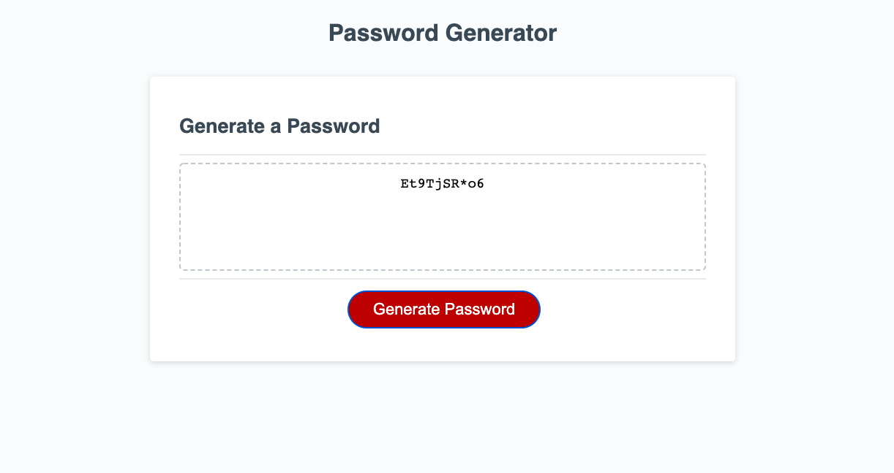

# Free Password Generator

## Table of Contents:

1. [Description](#description)
2. [Visual](#visual)
3. [Deployment](#deployment)

## Descritption

In this project, Javascript was used in combination with HTML and CSS, to create a password generator. Variables, functions, if statements, and else statements were all used to make this possible. When the user clicks the "Generate Password" button, they are asked a few questions to help determine criteria for the password such as length and the types of characters they would like to include in it. They are then presented with their generated password on the screen.

## Visual

## Deployment

[Link to live site.](https://slwooten.github.io/password-generator-free/)
